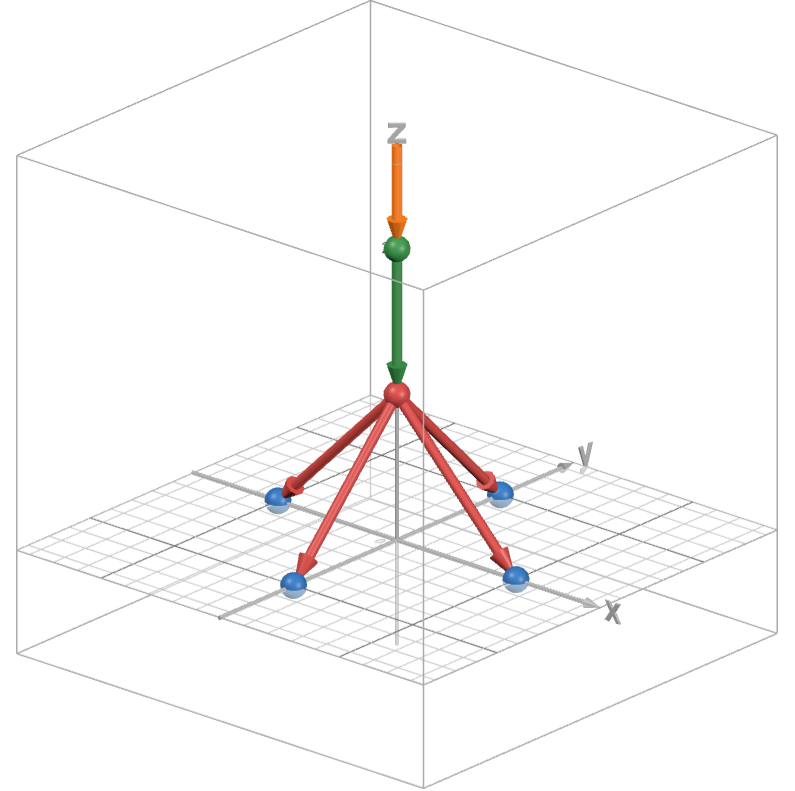

# Cat Cat Mechanics
 22级T3大模拟Round 2

## 题目背景：

&emsp;&emsp;在茫茫宇宙中有一个神秘的星系——这是猫猫生活的星系。这个星系的星球之间有着奇特的物理规律，猫猫对这些星球之间相互的力学非常感兴趣，于是以此为基础上做了一些观察，并且得到了一些结论。得到结论的猫猫非常兴奋，迫不及待地想要将这个结论分享给你，同时希望你在了解这些结论后，能帮助猫猫预测后续进行的力学实验结果。

## 问题描述：
&emsp;&emsp;整个星系在一个三维空间中，由若干颗星球构成，每个星球都有自己的三维空间坐标。这些星球的某两两之间可能会出现“引力纠缠”现象，具有“引力纠缠”关系的两颗星球可以传导“引力波”。

&emsp;&emsp;猫猫通过观察发现，星系中各星球的“引力纠缠”关系将整个星系组织成了“树”的结构，即如果将星球看作“点”，将“引力纠缠”看成“边”，那么构成的无向图上任意两点可达且路径唯一。猫猫注意到，“引力纠缠”关系**不具有传递性**，也就是说每个星球只会对与自己**直接**“引力纠缠”的星球施加(传导)“引力波”。

&emsp;&emsp;由于猫猫只研究某一时刻的力学问题，所以可以认为在这一时刻所有星球都静止不动，且可以看成没有体积大小的理想质点。不会有两个星球处于相同的位置。

#### 猫猫还发现了一些关于“引力波”的性质：
- “引力波”是**空间矢量**，既有大小，又有方向。 
- 具有“引力纠缠”关系的两颗星球之间可以传播“引力波”，该“引力波”的方向总是与过这两颗星球的空间直线**共线**。
- “引力波”的传导(施加)不会被星球阻挡，即当一个星球恰好在两个具有“引力纠缠”关系的星球中间时，“引力波”依然能正常被传导(施加)。

#### 猫猫还发现了星球间“引力波”的传播规律：
- 当一个星球被施加(传导)“引力波”时，这个星球会向与其具有“引力纠缠”关系的所有**除来源以外**的星球施加(传导)“引力波”。注意，“**除来源以外**”表明不会向施加(传导)“引力波”的来源星球施加(传导)“引力波”，尽管它们具有“引力纠缠”关系。
- 具体的传播规律如下：对于某个位于空间点$P$的星球, 有位于这些空间点$q_1, q_2, ..., q_k$的星球与它具有“引力纠缠”关系，其中已经**排除“引力波”来源**。当位于空间点$P$的星球被施加(传导)“引力波” $\vec{F}$时，$P$会对这$k$星球分别施加(传导)“引力波”: 具体地，会对位于$q_i$的星球产生“引力波”:
$$
\vec{f_i} =|\vec{F}| \cos<{\vec{F},\vec{Pq_i}}>  \frac{\vec{Pq_i}}{|\vec{Pq_i}|}\tag{1}
$$

#### 猫猫还发现“引力波”传播时会对星球产生“引力压迫”：
- “引力压迫”是**标量**，只有大小，没有方向。 
- 当一个星球被施加(传导)“引力波”时，“引力波”会对这个星球产生“引力压迫”。
- 一个星球受到的“引力压迫”的大小如下：对于某个位于空间点$P$的星球, 有位于这些空间点$q_1, q_2, ..., q_k$的星球与它具有“引力纠缠”关系，其中已经**排除“引力波”来源**。当位于空间点$P$的星球被施加(传导)“引力波” $\vec{F}$时
(1). 如果这个星球没有对其他星球施加(传导)“引力波”, 那么它受到的“引力压迫”即为受到的“引力波”的大小$|\vec{F}|$。
(2). 如果这个星球对其他星球施加(传导)了“引力波”，那么每一份施加(传导)都会产生一定的“引力压迫”，**它受到的总“引力压迫”为每一份施加(传导)产生的“引力压迫”之和**：
$$
    S = \sum_{i=1}^{k}|\vec{F}\times\vec{f_i}|\tag{2}
$$


#### 猫猫的实验：
&emsp;&emsp;对于一个星系，猫猫会告诉你各星球之间的“引力纠缠”关系，然后挑选一个幸运星球，人为地对其施加“引力波”。
&emsp;&emsp;猫猫希望你通过之前给出的信息，预测出星系中星球所受到的“引力压迫”的大小。


## **输入格式：**
&emsp;&emsp;第一行一个整数$n$，表示星系中星球的数量。
&emsp;&emsp;接下来$n$行，每一行有三个由空格隔开的整数，第$i+1$行的$x_i, y_i, z_i$, 表示第$i$个星球的三维空间坐标。
&emsp;&emsp;接下来$n-1$行，每一行有两个由空格隔开的整数$a, b$，表示这两个星球具有“引力纠缠”关系。
&emsp;&emsp;最后一行$4$个整数$P, F_x, F_y, F_z$，表示猫猫选择对第$P$个星球施加空间矢量为$(F_x, F_y, F_z)$的“引力波”。
&emsp;&emsp;数据保证星球间的位置不重复，且“引力纠缠”关系构成树结构。


## 输出格式：

&emsp;&emsp;输出共$n$行，每一行输出一个浮点数，第$i$行表示第$i$个星球受到的**引力压迫**的大小。
&emsp;&emsp;输出结果与标准答案的相对误差和绝对误差之一小于等于$10^{-4}$时认为正确。

## 样例
### 样例 1
**输入**
```
6
0 0 2
0 0 1
1 0 0
-1 0 0
0 1 0
0 -1 0
1 2
2 3
2 4
5 2
6 2
1 0 0 -1
```
**输出**
```
0
2
0.707107
0.707107
0.707107
0.707107
```

### 样例 2
**输入**
```
10        
-54 77 -95
60 -81 -61
33 60 -95 
31 16 13  
-5 -71 54 
83 -44 -97
94 27 33  
3 3 -4    
33 -2 61  
-65 66 89 
1 6       
8 10      
1 3       
1 8       
4 10      
9 5       
8 2       
5 8       
7 5
8 4182 -4427 4418
```
**输出**
```
52518982.325911
3078.602715
3992.110227
1119.173009
33927594.818122
5163.261895
4063.970157
66589620.692888
3911.295151
344135.046867
```

## 问题规模：

&emsp;&emsp;对于所有的测试点保证：
&emsp;&emsp;$1<n \leq 100$，$1 \leq P\leq n$
&emsp;&emsp;$|x_i|, |y_i|, |z_i| \leq 100$
&emsp;&emsp;$| F_x|, |F_y|,| F_z|\leq 5000$。

## 提示：
&emsp;&emsp;你需要使用浮点数进行计算，同时你需要考虑精度问题，尽可能的减少乘除法等可能降低精度的运算。
&emsp;&emsp;注意你的输出格式，如果使用```cout```直接输出，你可能会得到类似```3.39276e+07```这样的结果导致误判。可以考虑使用```printf("%lf", num);```进行输出

## 子任务
|测试点|性质|分数|
|-|-|-|
|$1,2,3,4,5$|“链条”|$25$|
|$6,7,8,9,10$|“菊花”|$25$|
|$11,12,13,14,15$|“直角”|$25$|
|$16,17,18,19,20$|无限制|$25$|

&emsp;&emsp;**“链条”性质**：“引力纠缠”关系构成的树中，每个星球最多和两个星球具有“引力纠缠”关系。数据保证$1$号节点必为叶子节点，且猫猫只会往$1$号节点施加“引力波”。
&emsp;&emsp;**“菊花”性质**：“引力纠缠”关系构成的树中，仅有唯一一个点不是叶子节点，称为“中心”节点，其他点均为叶子节点。数据保证$1$号节点必为“中心”节点，且猫猫只会往“中心”节点施加“引力波”。
&emsp;&emsp;**“直角”性质**：过具有“引力纠缠”关系的两个星球的直线，总是与$x,y,z$三轴之一平行。猫猫施加的“引力波”的方向也总是与$x,y,z$三轴之一平行。


## 样例解释
&emsp;&emsp;如图所示
&emsp;&emsp;猫猫对星球1施加$(0,0,-1)$的“引力波”。
&emsp;&emsp;由(1)式可得：星球1对星球2传导$(0,0,-1)$的“引力波”。
&emsp;&emsp;由(2)式可得：星球1受到的“引力压迫”为$0$。
&emsp;&emsp;星球2受到$(0,0,-1)$的“引力波”。
&emsp;&emsp;由(1)式可得：星球2传导出的“引力波”分别为：$(\frac{1}{2},0,-\frac{1}{2})$,$(-\frac{1}{2},0,-\frac{1}{2})$,$(0,\frac{1}{2},-\frac{1}{2})$,$(0,-\frac{1}{2},-\frac{1}{2})$
&emsp;&emsp;由(2)式可得：星球2受到的“引力压迫”为$2$。
&emsp;&emsp;星球3,4,5,6均没有对其他星球传导(施加)“引力波”，于是其受到的“引力压迫”均为其受到的“引力波”的大小，均为$\frac{ \sqrt{2}}{2}\approx 0.707107$。




### 附
#### 向量长度(取模)运算公式
&emsp;&emsp;设$\vec{a} = (a_x, a_y, a_z)$,则
$$
|\vec{a}| = \sqrt{a_x^2+a_y^2+a_z^2}
$$
#### 向量内积运算公式
&emsp;&emsp;设$\vec{a} = (a_x, a_y, a_z), \vec{b} = (b_x, b_y, b_z)$,则
$$
\vec{a}\cdot\vec{b} = a_x b_x + a_y b_y + a_z b_z
$$
 
#### 向量内积与角度余弦运算公式
&emsp;&emsp;设$\vec{a} = (a_x, a_y, a_z), \vec{b} = (b_x, b_y, b_z)$,则
$$
\cos<\vec{a},\vec{b}> = \frac{\vec{a}\cdot\vec{b}}{|\vec{a}||\vec{b}|}
$$
#### 向量叉乘运算公式
&emsp;&emsp;设$\vec{a} = (a_x, a_y, a_z), \vec{b} = (b_x, b_y, b_z)$,则
$$
\vec{a}\times\vec{b} = (a_y b_z - a_z b_y , a_z b_x - a_x b_z, a_x b_y - a_y b_x)
$$
#### 相对误差和绝对误差计算公式
&emsp;&emsp;设两个实数$a, b$，其中$a$为标准值，$b$为估计值(测量值)则：
$$
\text{绝对误差}(a, b) = |a-b| \\
\text{相对误差}(a, b) = \frac{|a-b|}{|a|}
$$